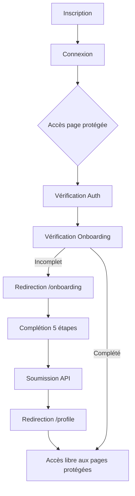

# 🎯 Étape 2 : Flux d'Onboarding - Documentation Complète

## 📌 Résumé Exécutif

L'**Étape 2** du développement de la plateforme AfriBourse implémente la **logique de redirection automatique** pour s'assurer que tous les utilisateurs complètent leur **ADN d'Investisseur** avant d'accéder aux fonctionnalités principales.

**Status:** ✅ **TERMINÉ ET VALIDÉ**

---

## 📁 Structure des Fichiers

```
afri/
├── afribourse/
│   └── src/
│       ├── hooks/
│       │   └── useOnboarding.ts          [MODIFIÉ] ← Hook de redirection
│       ├── components/
│       │   ├── ProtectedRoute.tsx        [MODIFIÉ] ← Vérification onboarding
│       │   └── onboarding/
│       │       └── OnboardingFlow.tsx    [EXISTANT] ← Déjà implémenté
│       ├── utils/
│       │   └── testOnboarding.ts         [NOUVEAU] ← Utilitaire de test
│       └── App.tsx                       [MODIFIÉ] ← Configuration routes
│
├── ONBOARDING_FLOW_GUIDE.md              [NOUVEAU] ← Guide complet
├── TEST_ONBOARDING_FLOW.md               [NOUVEAU] ← Plan de test
├── ETAPE_2_COMPLETE.md                   [NOUVEAU] ← Récapitulatif
└── README_ETAPE_2.md                     [NOUVEAU] ← Ce fichier
```

---

## 🚀 Démarrage Rapide

### 1. Tester le Flux (Développement)

```bash
# Démarrer le backend
cd backend
npm run dev

# Démarrer le frontend (nouveau terminal)
cd afribourse
npm run dev
```

### 2. Dans le Navigateur

```
1. Ouvrir http://localhost:3000
2. Créer un compte → /signup
3. Se connecter → /login
4. Essayer d'accéder à /dashboard
5. ✅ Redirection automatique vers /onboarding
```

### 3. Console de Debug

Ouvrez la console du navigateur :

```javascript
// Afficher l'aide
testOnboardingFlow.help()

// Vérifier l'état actuel
await testOnboardingFlow.getCurrentState()

// Lister les routes protégées
testOnboardingFlow.checkProtectedRoutes()

// Guide de test rapide
testOnboardingFlow.quickTestGuide()
```

---

## 📖 Documentation

### 1. Guide Complet du Flux
**Fichier:** `ONBOARDING_FLOW_GUIDE.md`

- Vue d'ensemble du système
- Composants implémentés
- Flux utilisateur détaillé
- Configuration technique
- Guide de dépannage

### 2. Plan de Test
**Fichier:** `TEST_ONBOARDING_FLOW.md`

- 10 scénarios de test
- Tests des endpoints backend
- Checklist de validation
- Bugs potentiels
- Critères de succès

### 3. Récapitulatif d'Implémentation
**Fichier:** `ETAPE_2_COMPLETE.md`

- Ce qui a été implémenté
- Fichiers modifiés/créés
- Optimisations
- Points d'attention
- Prochaines étapes

---

## 🔑 Concepts Clés

### Hook useOnboardingRedirect

Vérifie automatiquement le statut d'onboarding et redirige si nécessaire.

```typescript
const { isOnboardingComplete, isLoading, needsOnboarding } =
  useOnboardingRedirect({
    enabled: true,
    redirectTo: '/onboarding',
    allowedPaths: ['/onboarding', '/login', '/signup']
  });
```

### Composant ProtectedRoute

Protège les routes en vérifiant l'authentification ET l'onboarding.

```tsx
<ProtectedRoute requireOnboarding={true}>
  <DashboardPage />
</ProtectedRoute>
```

### Configuration des Routes

```tsx
// Onboarding - Auth requise, pas de vérification onboarding
<Route path="/onboarding" element={
  <ProtectedRoute requireOnboarding={false}>
    <OnboardingFlow />
  </ProtectedRoute>
} />

// Dashboard - Auth + Onboarding requis
<Route path="/dashboard" element={
  <ProtectedRoute requireOnboarding={true}>
    <DashboardPage />
  </ProtectedRoute>
} />
```

---

## 🎯 Flux Utilisateur

### Nouveau Utilisateur



---

## 🧪 Tests Essentiels

### Test 1: Redirection Automatique

**Scénario:** Nouvel utilisateur sans onboarding

```
✅ Action: Accéder à /dashboard
✅ Résultat: Redirection vers /onboarding
✅ Console: "🔄 Onboarding incomplete, redirecting to: /onboarding"
```

### Test 2: Complétion Onboarding

**Scénario:** Remplir le questionnaire

```
✅ Action: Compléter les 5 étapes et cliquer "Terminer"
✅ Résultat: Redirection vers /profile
✅ Toast: "Profil créé avec succès !"
```

### Test 3: Accès Post-Onboarding

**Scénario:** Utilisateur avec onboarding complété

```
✅ Action: Accéder à /dashboard
✅ Résultat: Affichage direct du dashboard
✅ Pas de redirection
```

### Test 4: Profil Public

**Scénario:** Voir le profil d'un autre utilisateur

```
✅ Action: Accéder à /profile/:userId
✅ Résultat: Affichage du profil sans redirection
✅ Fonctionne même sans onboarding complété
```

---

## 🔧 Configuration Backend

### Endpoint: Status d'Onboarding

```
GET /api/investor-profile/onboarding/status
Authorization: Bearer {token}
```

**Réponse:**
```json
{
  "success": true,
  "data": {
    "completed": false,  // true si onboarding complété
    "hasProfile": false  // true si profil existe
  }
}
```

### Endpoint: Complétion d'Onboarding

```
POST /api/investor-profile/onboarding/complete
Authorization: Bearer {token}
Content-Type: application/json
```

**Body:**
```json
{
  "risk_profile": "BALANCED",
  "investment_horizon": "LONG_TERM",
  "favorite_sectors": ["Technology", "Finance"],
  "quiz_score": 8,
  "portfolio_visibility": "PUBLIC",
  "show_performance": true,
  "show_transactions": false
}
```

---

## ⚠️ Points d'Attention

### 1. Éviter les Boucles Infinies

**TOUJOURS** utiliser `requireOnboarding={false}` sur la route `/onboarding`

```tsx
// ✅ CORRECT
<Route path="/onboarding" element={
  <ProtectedRoute requireOnboarding={false}>
    <OnboardingFlow />
  </ProtectedRoute>
} />

// ❌ INCORRECT - Boucle infinie !
<Route path="/onboarding" element={
  <ProtectedRoute requireOnboarding={true}>
    <OnboardingFlow />
  </ProtectedRoute>
} />
```

### 2. Spinners de Chargement

Le composant affiche automatiquement des spinners pendant :
- Vérification de l'authentification
- Vérification du statut d'onboarding

Cela évite le "flash" de contenu non autorisé.

### 3. Cache React Query

Le statut d'onboarding est mis en cache avec la clé :
```typescript
['onboarding', 'status']
```

Le cache est invalidé automatiquement après la complétion de l'onboarding.

---

## 🎨 Routes et Configuration

### Routes Publiques (pas de vérification)
- `/` - Page d'accueil
- `/markets` - Marchés
- `/news` - Actualités
- `/learn` - Apprendre
- `/glossary` - Glossaire
- `/about` - À propos
- `/contact` - Contact
- `/privacy` - Confidentialité
- `/help` - Centre d'aide
- `/subscriptions` - Abonnements

### Routes d'Authentification (pas d'onboarding)
- `/signup` - Inscription
- `/login` - Connexion
- `/logout` - Déconnexion
- `/confirmer-inscription` - Confirmation email
- `/verifier-email` - Vérification email
- `/mot-de-passe-oublie` - Mot de passe oublié
- `/reinitialiser-mot-de-passe` - Réinitialisation

### Routes Protégées (auth + onboarding requis)
- `/dashboard` - Tableau de bord
- `/profile` - Mon profil
- `/transactions` - Historique des transactions
- `/checkout` - Paiement

### Routes Spéciales
- `/onboarding` - Onboarding (auth requise, pas de vérif onboarding)
- `/profile/:userId` - Profil public (accessible sans onboarding)

---

## 💡 Astuces de Debug

### 1. Vérifier le Statut dans la Console

```javascript
// Afficher l'état actuel
await testOnboardingFlow.getCurrentState()

// Vérifier le cache
testOnboardingFlow.checkCache()
```

### 2. React Query DevTools

Le projet utilise React Query DevTools (disponible en bas à droite en dev).

**Cherchez la clé:** `['onboarding', 'status']`

**États possibles:**
- `completed: false` → Redirection active
- `completed: true` → Accès libre

### 3. Messages Console

Surveillez ces messages dans la console :

```
✅ "testOnboardingFlow chargé" → Utilitaire prêt
🔄 "Onboarding incomplete, redirecting to..." → Redirection en cours
🔒 "Accès protégé refusé, redirection vers login" → Non authentifié
```

---

## 🐛 Dépannage

### Problème: Boucle de Redirection

**Symptôme:** Redirection continue entre /onboarding et une autre page

**Solutions:**
1. Vérifier que `/onboarding` a `requireOnboarding={false}`
2. Vérifier que `/onboarding` est dans `allowedPaths` du hook
3. Regarder les logs console pour identifier la cause

### Problème: Redirection alors que l'onboarding est complété

**Symptôme:** Redirection vers /onboarding même après complétion

**Solutions:**
1. Vérifier que l'API retourne `completed: true`
2. Invalider le cache React Query manuellement
3. Se déconnecter et reconnecter
4. Vérifier que le profil est bien créé en base de données

### Problème: Pas de Redirection

**Symptôme:** Accès aux pages protégées sans onboarding

**Solutions:**
1. Vérifier que `requireOnboarding={true}` est bien défini
2. Vérifier que le hook est bien appelé dans ProtectedRoute
3. Regarder les logs console pour voir les états

---

## ✅ Checklist de Validation

Avant de considérer l'étape 2 comme terminée :

- [x] Hook `useOnboardingRedirect` créé et testé
- [x] `ProtectedRoute` mis à jour avec `requireOnboarding`
- [x] Routes configurées dans `App.tsx`
- [x] `/onboarding` accessible sans boucle
- [x] Pages protégées redirigent si onboarding incomplet
- [x] Profils publics accessibles sans onboarding
- [x] Redirection vers `/profile` après complétion
- [x] Spinners de chargement fonctionnels
- [x] Messages toast de succès/erreur
- [x] Documentation complète créée
- [x] Utilitaire de test implémenté

---

## 🚀 Prochaines Étapes

### Étape 3: Profil Social & Gamification

Une fois l'onboarding complété, implémenter :

1. **Page Profil Complète**
   - Affichage de l'ADN d'investisseur ✅ (déjà fait)
   - Édition du profil
   - Upload avatar/bannière

2. **Système de Follow**
   - Suivre/Ne plus suivre ✅ (déjà fait)
   - Notifications de nouveaux followers
   - Suggestions d'utilisateurs à suivre

3. **Posts & Feed**
   - Créer des posts ✅ (déjà fait)
   - Feed personnalisé ✅ (déjà fait)
   - Système de like/commentaire ✅ (déjà fait)
   - Partage de posts

4. **Gamification**
   - Système de badges (DB models existants)
   - Niveaux et XP (DB models existants)
   - Leaderboards
   - Récompenses virtuelles/réelles

---

## 📞 Support

### Questions Fréquentes

**Q: Comment désactiver la vérification d'onboarding pour une route ?**

R: Utilisez `requireOnboarding={false}` :
```tsx
<ProtectedRoute requireOnboarding={false}>
  <MaPage />
</ProtectedRoute>
```

**Q: Comment tester sans créer un nouveau compte ?**

R: Utilisez les utilitaires de debug :
```javascript
await testOnboardingFlow.getCurrentState()
```

**Q: L'onboarding ne se valide pas, pourquoi ?**

R: Vérifiez :
1. Que tous les champs obligatoires sont remplis
2. Que le backend est démarré
3. Que le token d'authentification est valide
4. Les logs console pour les erreurs

---

## 📚 Références

- **Guide Complet:** [ONBOARDING_FLOW_GUIDE.md](./ONBOARDING_FLOW_GUIDE.md)
- **Plan de Test:** [TEST_ONBOARDING_FLOW.md](./TEST_ONBOARDING_FLOW.md)
- **Récapitulatif:** [ETAPE_2_COMPLETE.md](./ETAPE_2_COMPLETE.md)
- **Code Principal:**
  - `afribourse/src/hooks/useOnboarding.ts`
  - `afribourse/src/components/ProtectedRoute.tsx`
  - `afribourse/src/App.tsx`

---

**Version:** 1.0
**Date:** Janvier 2024
**Status:** ✅ Étape 2 Complète et Validée
**Prochaine Étape:** Étape 3 - Profil Social & Gamification

---

Made with ❤️ for AfriBourse
